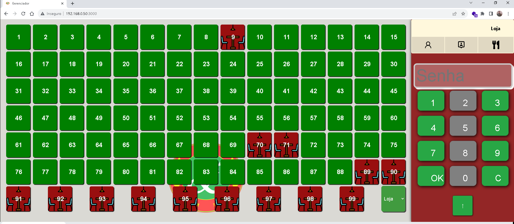
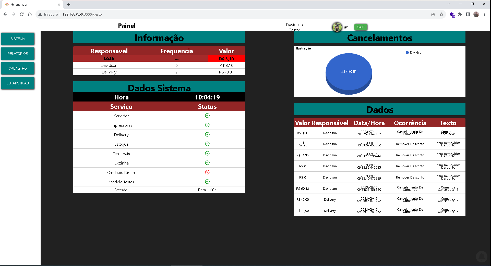
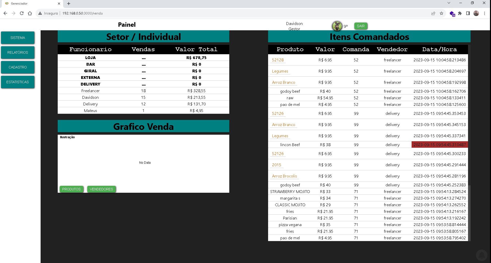
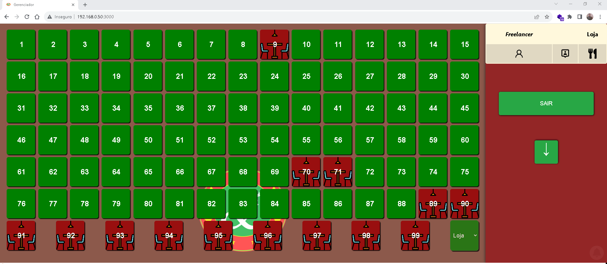
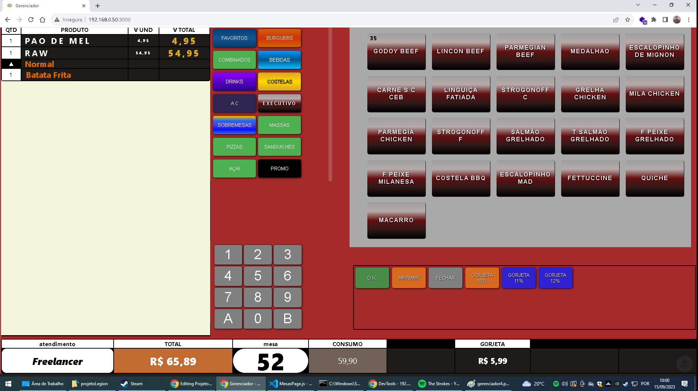
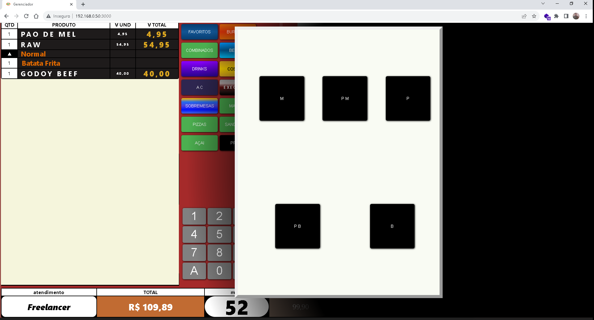
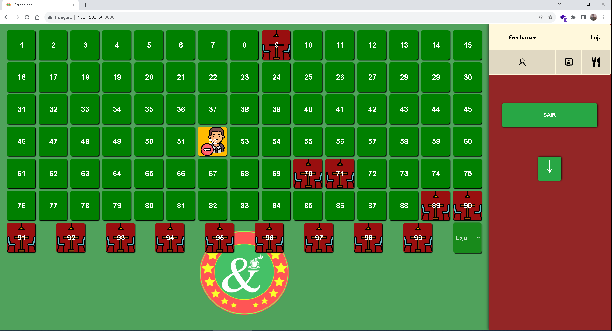

# **📱 WebIntern Restaurante Digital**

Desenvolvimento de projeto react para gestão de mesas e comandas.

 

## 📜 Status
> Status: em desenvolvimento

## 💻 Funcionalidades

> * ✔ Cardapio Digital integrado
> * ✔ Area de Comanda
> * ✔ Area de Delivery
> * ✔ Area de Bar
> * ✔ Relatórios
> * ✔ Cadastro de Produtos 📲
> * ✔ Cadastro de Funcionarios 📲
> * ✔ Cadastro de Clientes 📲

###  **🔗 Links e autorias**

 

> <a href="https://github.com/davidsongsc"><b> @davidsongsc </b></a>
>  
> <q>Obrigado a todos que contribuíram e pode nos ajudar neste projeto de estudos.</q>
>
> 
>
>
>

 

## 👀 Preview
 
> 
> 
> 
> 
> 
> 
> 
> 
> 
> 

 
