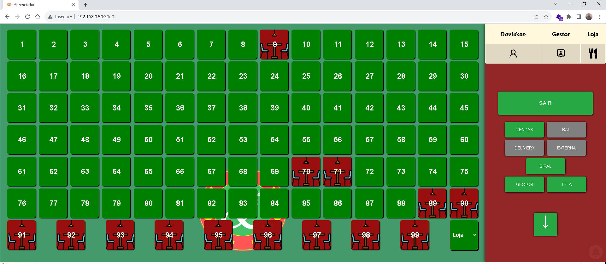

# **📱 Sistema Restaurante Digital**

Desenvolvimento de projeto react para gestão de mesas e comandas. Este projeto permite gerir pequenos estabelecimentos comerciais.

 

## 📜 Status
> Status: em desenvolvimento

## 💻 Funcionalidades

> * ✔ Cardapio Digital integrado
> * ✔ Area de Comanda
> * ✔ Area de Delivery
> * ✔ Area de Bar
> * ✔ Relatórios
> * ✔ Cadastro de Produtos 📲
> * ✔ Cadastro de Funcionarios 📲
> * ✔ Cadastro de Clientes 📲

###  **🔗 Links e autorias**

 

 

## 👀 Preview
 
> 
> 
> 
> 
> 
> 
> 
> 
> 
> 

 
