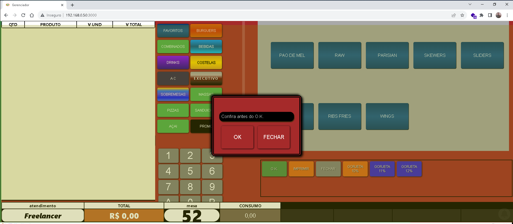
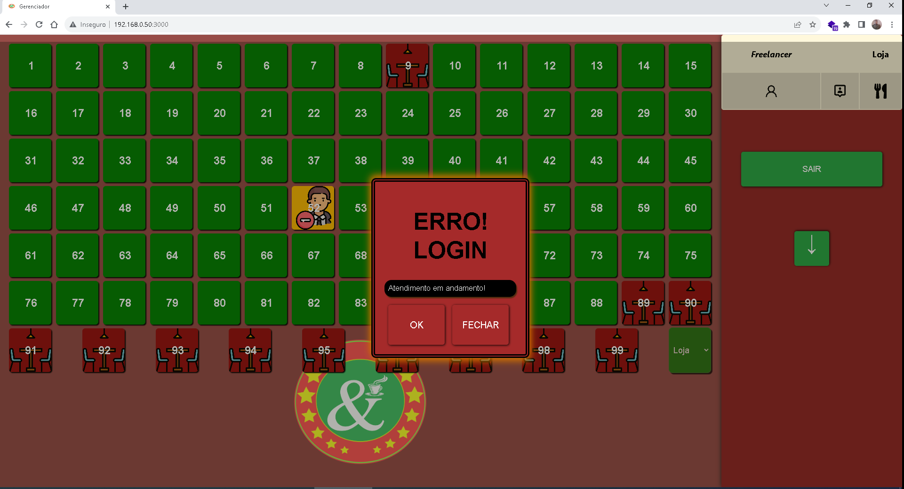

# **📱 Sistema Restaurante Digital**
<div align="center" >
Desenvolvimento de projeto react para gestão de mesas e comandas. Este projeto permite gerir pequenos estabelecimentos comerciais.
</div>
</br>

## 🚀 Tecnologias utilizadas 

<br/>
<p align="left">
  <a href="https://developer.mozilla.org/pt-BR/docs/Web/HTML" target="_blank">
    
  </a>

  <a href="https://developer.mozilla.org/pt-BR/docs/Web/CSS" target="_blank">
    
  </a>
  
  <a href="https://developer.mozilla.org/en-US/docs/Web/JavaScript" target="_blank">
    
  </a>

<a href="https://react.dev/" target="_blank">
    
  </a>
</p>

## 📜 Notas
> * Status: em desenvolvimento
> * Versão: 1.00A

### :memo: Funcionalidades: 
> * ✔ Cardapio Digital integrado 📲
> * ✔ Area de Comanda
> * ✔ Area de Delivery
> * ✔ Area de Bar
> * ✔ Relatórios
> * ✔ Cadastro de Produtos 📲
> * ✔ Cadastro de Funcionarios 📲
> * ✔ Cadastro de Clientes 📲

### Dependências globais

dependência necessaria:

- Node.js LTS v16 (ou qualquer versão superior)

Após ter o Node.js Instalado, execute o seguinte comando na pasta raiz:

```bash
npm install
```

para rodar o projeto localmente, use o seguinte comando:

```bash
npm start
```

</br>

</br>


## 👀 Preview
 
> 
> 
> 
> 
> 
> 
> 
> 
> 

</br>


## :mortar_board: Autores

<table align="center">
    <tr>
        <td align="center">
            <a href="https://github.com/davidsongsc">
                
                <br />
                <sub><b>Davidson George</b></sub>
            </a>
        </td>    
    </tr>
</table>
<h4 align="center">
  linkedin <a href="https://www.linkedin.com/in/davidsongsc/" target="_blank"> Davidson George </a>
</h4>
